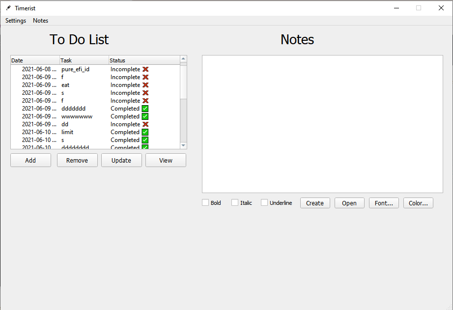
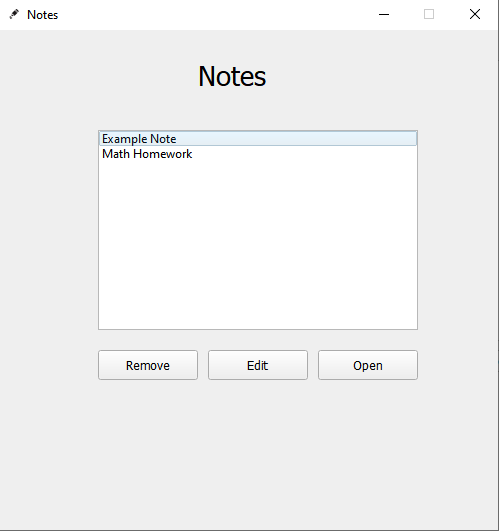
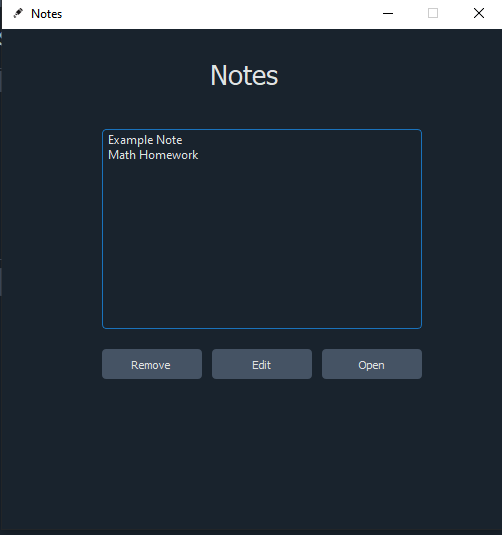

<div style="margin-left: 50px">
<h1>Timerist (In Construction 👷 🚧)</h1>


  
<h4>An application that will help students organize their day at school :)</h4>
</div>
<br>


Table of contents
=================
<!--ts-->
   * [Table of contents](#Table-of-contents)
   * [Philosophy](#Philosophy)
   * [Screenshots](#Screenshots)
   * [Codebase Description](#Codebase-Description)
   * [Codebase Directory Structure](#Codebase-Directory-Structure)
   * [Running the Application from Source](#Running-the-Application-from-Source)
<!--te-->

Philosophy
===
Students of which I am, have a lot of different things that we ought to complete by the end of each day. Although completing all of our tasks may seem easy, completing them with quality and staying without stress takes quite some more effort. Remembering everything that we have to do in our brains is not efficient and most of the time leads to poor quality work and stress on students and individuals. Staying organized, stressless, and completing all that we have to do on time can be done through Timerist. Timerist organizes your day but allowing you to set tasks and assign them due dates that have an alarm and countdown. Notes and documents can be used for completing homework, breaking down a problem, and writing down a thought into text. Timerist's rich assistance to the brain's ability to remember and prioritize things will greatly benefit one's responsibility and success.


Screenshots
===
#### light and dark theme mode:






Codebase Description
===
| Folder/File     | Purpose       
| -------------   |:-------------:
| .radical-dev    | <p align="left">The ".radical-dev" folder contains the source files for Timerist's command line interface that was built for speeding up the development of Timerist using Golang.</p>
| Resource        | <p align="left">The Resource package is a utility composed of modules, classes, & functions that can help us easily break down implementations for GUI.</p> 
| database        | <p align="left">A folder database that handles the notes created by the user in the application.</p>      
| images          | <p align="left">A folder that contains image resources for the application and the "README.md" file.</p>
| README.md       | <p align="left">A markdown file describing our application, and the underlying source code that works behind the scenes to help the user organize their day at school.</p>
| alarm.gif       | <p align="left">A gif file that is shown when one of the tasks that the user has created in the "to do" section, has not been completed by the assigned date and time.</p>
| alarm.wav       | <p align="left">A wav file that is played alongside the "alarm.gif" file to show the user that the time is up, and that they need to complete their task as soon as possible to stay on time.</p>
| app.py          | <p align="left">A module that combines all other source files, and runs the application.</p>
| blueprint       | <p align="left">A blueprint for the requirements that our application needs to meet at the minimum.</p>
| data.txt        | <p align="left">A textfile that acts as a "database" for all the todos that the user has made in the application's "todo" section.</p>
| interface.ui    | <p align="left">A .ui file composed of qml tags that were at first, the user interface our application which had been expanded and improved by python code.</p>
| light-theme.qss | <p align="left">A .qss file that is a stylesheet for our application.</p>
| requirements.txt | <p align="left">A text file containing the required dependencies that are needed in order to run this application from source.</p>

Codebase Directory Structure
===
```
Timerist
│
└───.radical-dev
│   │   main.exe
|   |   main.go   
└───Resource
│   │   description.template
│   │   query.py
│   │   time.py
└───database
│   │   Example Note     
│   │   Math Homework
└───images
│   │   button.png
│   │   icon.png
│   │   icon2.png
│   │   main-dark.png
│   │   main.png
│   │   notes-dark.png
│   │   notes.png
|   README.md   
│   alarm.gif
│   alarm.wav
│   app.py
│   blueprint
│   data.txt
│   interface.ui
│   light-theme.qss
│   requirements.txt
```

Running the Application from Source
===
### Running from source (Windows):
Make sure that you have 'pip' installed on your system, and that you have added it to your Python path.
If you have completed the step above, you may move on to completing the steps below.
Open up your terminal, and type or paste in the following:
1. `git clone "https://github.com/DaEliteCoder/Timerist.git"`
2. `cd Timerist`
3. `pip install -r requirements.txt`
4. `python -u app.py`
---
#### Optional: To check if the dependencies were installed properly, type or paste in the following in your terminal: 
`pip freeze`
### Running from source (MacOS / Linux):
Make sure that you have 'pip' installed on your system, and that you have added it to your Python path.
If you have completed the step above, you may move on to completing the steps below. Remember, Python version 2 is pre-installed on your operating system, so you will have to say pip3 and python3 to specify that you're not using version 2.
Open up your terminal, and type or paste in the following:
1. `git clone "https://github.com/DaEliteCoder/Timerist.git"`
2. `cd Timerist`
3. `pip3 install -r requirements.txt`
4. `python3 -u app.py`
---
#### Optional: To check if the dependencies were installed properly, type or paste in the following in your terminal: 
`pip3 freeze`

<p align="center">Note: Binaries and Executables will be realeased in the near future, as a part of the distribution of this application 😀.</p>


