<h1 align="center">Timerist's Documentation</h1>

Table of Contents
====
<!--ts-->   
* [Installation](#installation)
* [Usage](#Usage)
    * [Managing Tasks](#Managing-Tasks)
    * [Searching For Tasks](#Searching-For-Tasks)
    * [Recycling Tasks](#Recycling-Tasks)
    * [Archiving Tasks](#Archiving-Tasks)
* [Help](#Help)
    * [Settings](#Settings)
<!--te-->

Installation
====

1. Open up the app by creating a shortcut to Timerist.exe in the ZIP file package.

2. Click on the Shortcut every time you want to run the app.

Usage
====

Managing Tasks
------------------------------------------------

#### In The App's Interface, you should see the following in the top-left corner:

<!--Image Path Prefix-->
<!--https://github.com/TheEliteCoder1/Timerist/blob/main/-->   

#### Here's what each Option does:

1. The Add Option creates a new task by promting the following Dialogue:

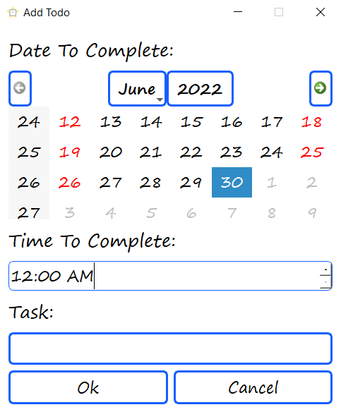

The following Dialogue requests for a Date and Time for when the task is to be completed. The name of the task will be added to the todo-list.

2. The Update Option updates a task to be completed if the user
has finished a task, and vice versa to make it incomplete if they change thier mind:

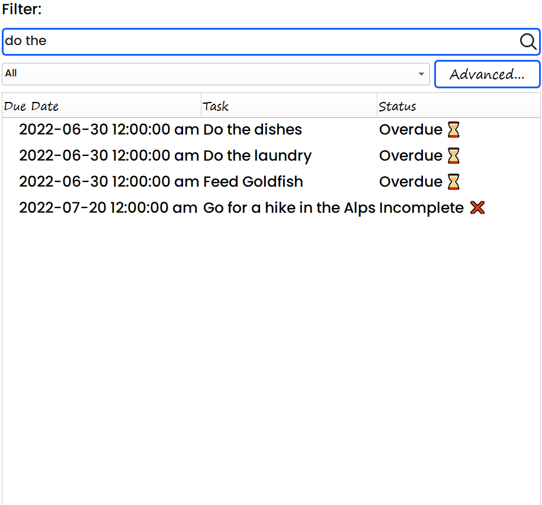

3. The View Option allows the user to see the details of the current status for a selected task.

If the task is still incomplete, and there is still time to complete it, the View Dialogue will show the amount of time left in Days, Hours, Minutes and Seconds: 

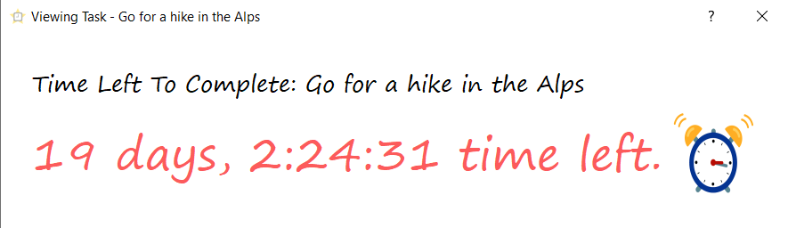

If the task is still incomplete, and there is no time to complete it, the View Dialogue will display the following message with an alarm noise:

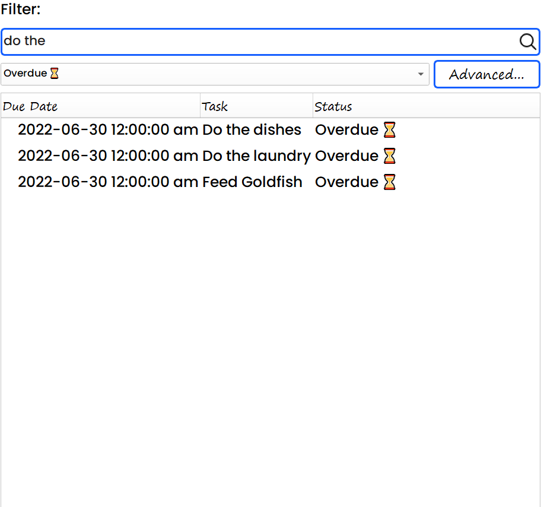

If the task is completed, the View Dialogue will display the following message:

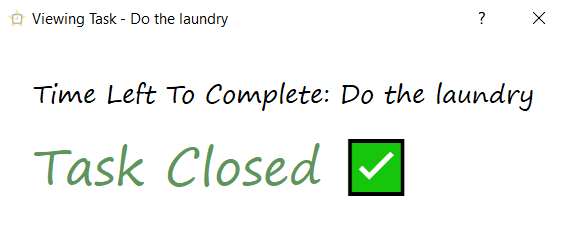

4. The Refresh Option refreshes the current state of the Todo-list:

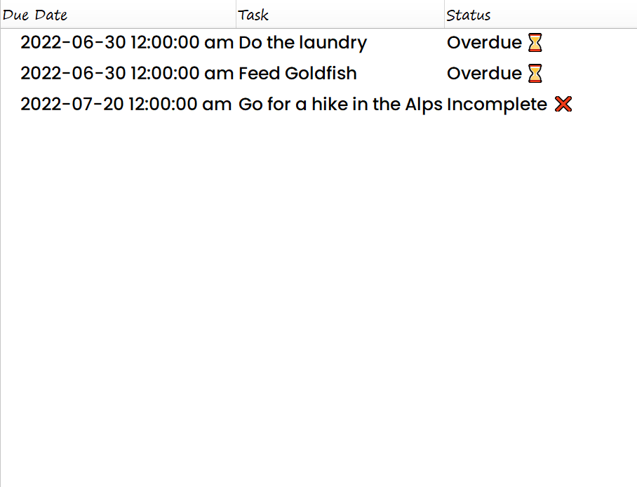

The following example shows how when you have incomplete tasks that are overdue, they will show as 'Incomplete' without giving you more insight to how much time is left without the View Option.
But if you refresh the Todo-list, it will mark the Status as Overdue instead of Incomplete.

5. The Clear Option removes all the tasks from the Todo-list and sends them to the Recycled Tab:

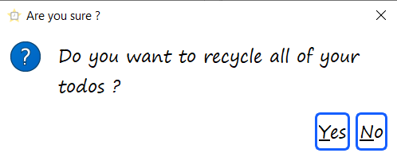

If you press 'Yes', you should see an empty Todo-list:

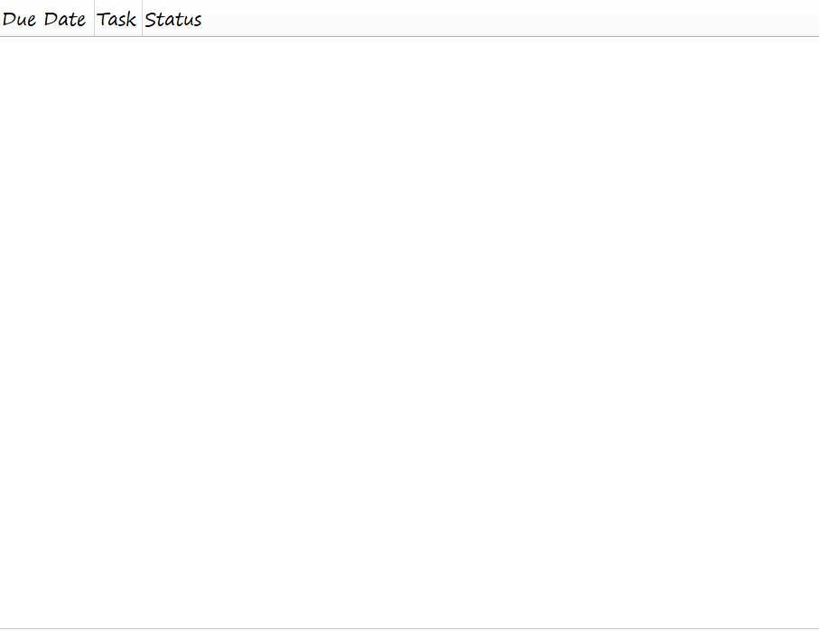

Searching For Tasks
------------------------------------------------

#### In the App's Interface, you should see the following
below the Todo-list Options area:

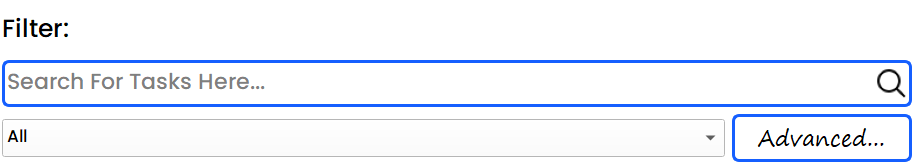

#### Here's what each Tool does:

1. The Search Bar allows you to Search for your tasks by entering the Task's Name:

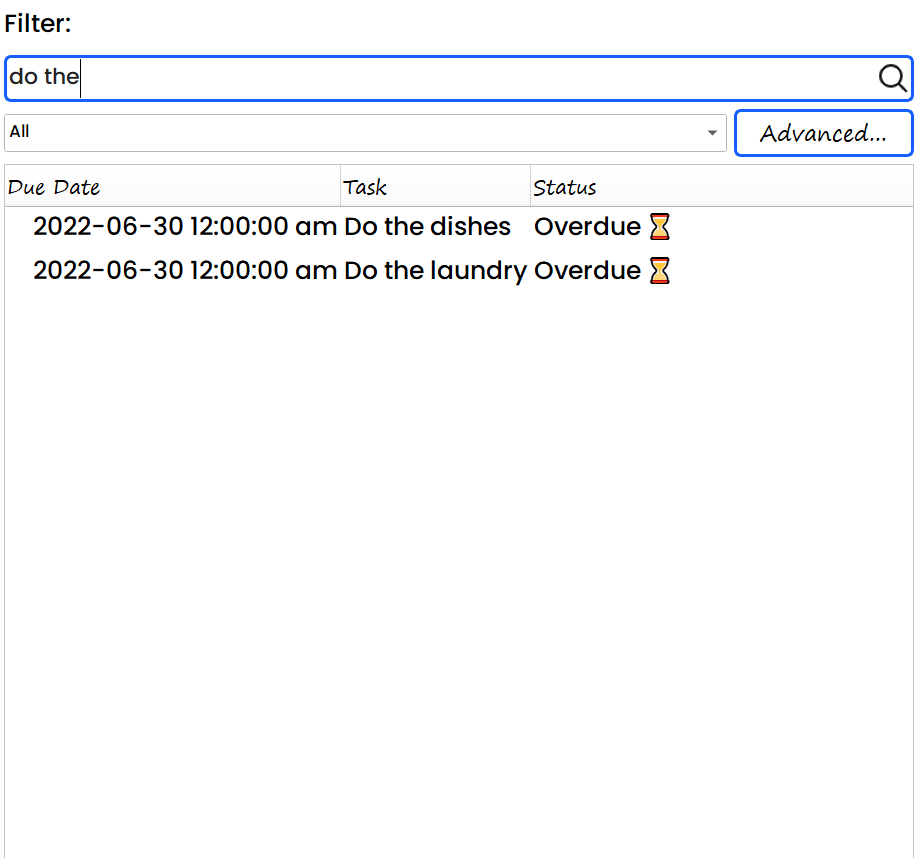

Only tasks that match the search requirement will show.

2. The Filter By Status Tool will Only display tasks that match
the requested Status. There are 4 diffrent options - All, Incomplete, Overdue, Completed.

3. The Advacned Filter Option will prompt you with the following Dialogue:

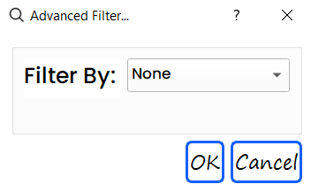

There are four options to filter tasks with the Advanced Filter Tool:

1. The Filter by Due Date Option only displays tasks that match the specified due date:

2. The Filter by Due Date Range Option only displays tasks that have a due date that falls between the specified range of dates including the Start Date and End Date:

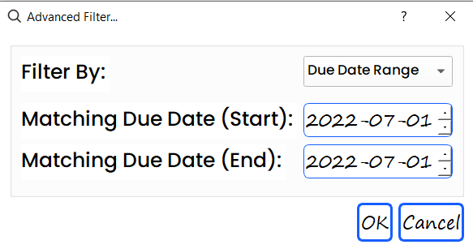

3. The Sort By Upcoming Option sorts the tasks with the following requirements:

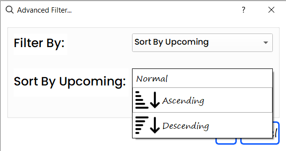

Recycling Tasks
------------------------------------------------

#### In The App's Interface, you should see the following below the top-right section:

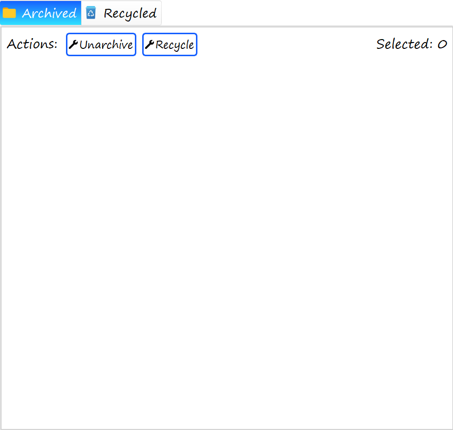

Whenever you recycle a task from the Todo-list, they go to the Recycled Tab.

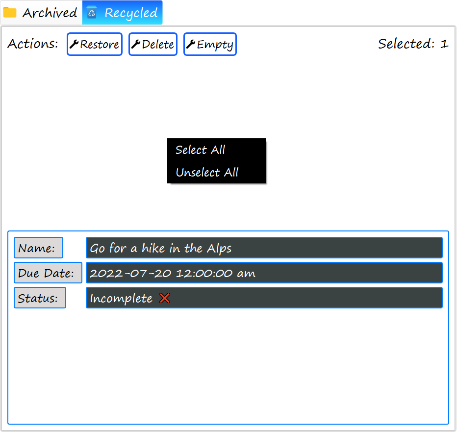

1. The Restore Option will bring the task back to the Todo-list.

2. The Delete Option will permanently delete the task forever.

3. The Clear Option will permanently delete all tasks in the Recycled Tab forever.

Archiving Tasks
------------------------------------------------

Whenever you archive a task from the Todo-list, they go to the Archived Tab.

1. The Unarchive Option will bring the task back to the Todo-list.

2. The Recycle Option will send the task to the Recycled Tab.

Help
====

Settings
-------------------------------------

When you click the settings button found in the top-right corner 
of the Interface, the following Dialogue should show:

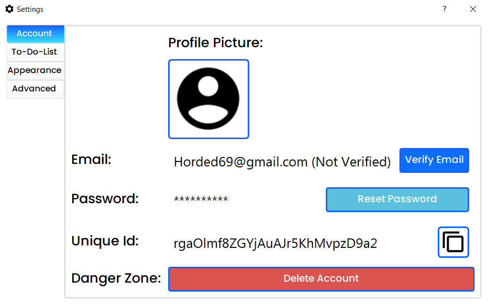

There are 4 Tabs with Diffrent Options:
1. Account - Contains settings to do with your Account.
- The verify email button sends an verification email to your account's email.
- The reset password button sends an email to reset your Account's password.
- The Unique Id copy button copies your Account's Unique Id to the clipboard.
- The delete account button deletes your account permanently if you press 'yes' on the confirmation dialogue.
2. To-Do-List - Contains settings pertaining to the Todo-list
- The 'Ring Alarm When Task Is Overdue' option will ring an alarm immediatley when you view a task that is overdue.
- The 'Show Confirmation Dialog Before Emptying Bin' option will show a confirmation dialog before permenantly deleting all tasks from the recycled tab.
3. Appearance - Contains settings to customize the apperance of the app.
- The theme option allows you to customize the appearance of the Interface with a variety of diffrent themes. (The theme that was used for this demonstration was Aquatic.)
- The cursor option allows you to change the mouse cursor apperance in the app with cursors from Windows, Mac & Linux regardless of which operating system you're on.
- The task font size option allows you to change the font size of the tasks displayed on the todo-list.
- The app font option allows you to change the font used in the App's interface. (The app font that was used for this demonstration was Segoe Print)
4. Advanced - Contains Advanced Settings
- The 'Reset To Default' option resets all of your settings to the default configuration.